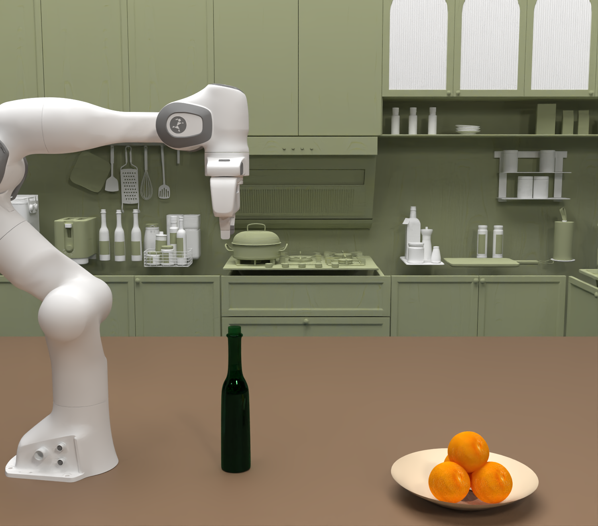
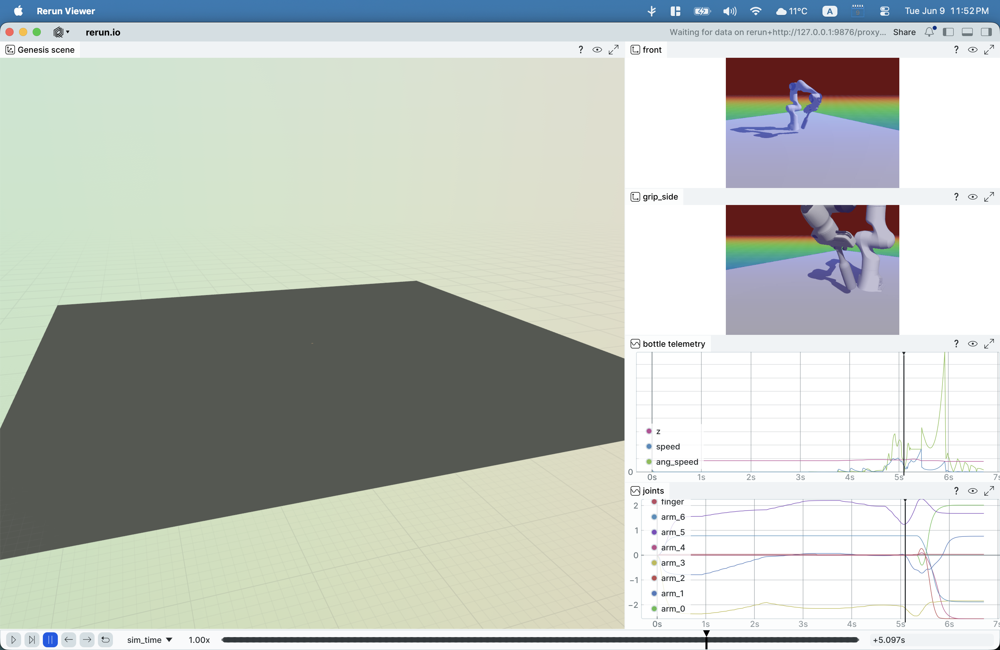

# genesis_rerun — a live Genesis → Rerun logging bridge

A small, dependency-light bridge that streams a [Genesis](https://genesis-embodied-ai.github.io/)
physics scene into [Rerun](https://rerun.io): link transforms, cameras (RGB + depth +
reprojected point clouds), contact forces, IMU, tactile, and lidar — plus static visual
meshes — with one setup call and one call per step.



*A Genesis simulation — a Franka Panda, a green glass bottle, and a bowl of oranges in a
photoreal kitchen, raytraced. `genesis_rerun` streams scenes like this into Rerun: every
link transform, camera, and sensor, one call per step.*

…and the same kind of recording, live in the Rerun viewer:



*Logged through the bridge: the 3D scene, two camera RGB streams, and bottle/joint time
series, all under shared `sim_step` / `sim_time` timelines.*

## Why it exists

Genesis exposes simulation state through duck-typed, occasionally batched, sometimes
CUDA-resident objects, and its visual-geometry API drifts between releases. This bridge
absorbs that: each sensor adapter is defensive about shapes and tensor backends, converts
Genesis' conventions to Rerun's, and degrades gracefully when an accessor is missing — so
logging a scene is a two-line concern, not a per-project re-implementation.

The bridge itself imports with **only `numpy` + `rerun-sdk`** — no Genesis, no GPU — which
is what lets the whole sensor layer be unit-tested anywhere (see [Tests](#tests)).

## Install

```bash
pip install -e .              # the bridge + its runtime deps (numpy, rerun-sdk)
pip install -e ".[examples]"  # + genesis-world, to run the examples below
pip install -e ".[dev]"       # + pytest / ruff / mypy
```

## Quickstart

The self-contained example builds a tiny scene (plane + falling box + camera) and streams it
to Rerun. It runs on CPU — **no GPU required** (verified on an Apple-silicon Mac):

```bash
# stream live into a spawned viewer
python examples/minimal_genesis_rerun.py

# …or write a recording you can open later or share
python examples/minimal_genesis_rerun.py --no-spawn --save-rrd docs/minimal_demo.rrd
```

A pre-generated recording from that exact command is committed at
[`docs/minimal_demo.rrd`](docs/minimal_demo.rrd) — open it with `rerun docs/minimal_demo.rrd`.

`examples/franka_reach.py` is the richer companion: a Franka Panda sweeps an orange toward a
bowl with every sensor enabled and a hand-authored multi-view blueprint. It also runs with no
external assets (set `LIGHTWHEEL_KITCHEN=/path/to/stage.usda` for a textured backdrop).

## The API

```python
from genesis_rerun import GenesisRerunLogger

logger = GenesisRerunLogger(scene, sensors=["transforms", "camera", "contact", "imu"])
logger.log_setup()                      # static: meshes + world ViewCoordinates
for step in range(n):
    scene.step()
    logger.log_step(step, step * dt)    # per-step: timelines + enabled sensors
```

| `sensors=` key | What it logs | Rerun archetype |
|---|---|---|
| `transforms` | every rigid link pose | `Transform3D` |
| `camera`     | viewer cameras: RGB, depth, and depth → world point cloud | `Image`, `DepthImage`, `Points3D` |
| `contact`    | contact-force sensor vectors | `Arrows3D` |
| `imu`        | IMU `lin_acc` / `ang_vel` / `mag`, per axis | `Scalars` |
| `tactile`    | penetration / force / distance / temperature summaries | `Scalars` |
| `lidar`      | raycaster distance summaries (min / mean / max) | `Scalars` |
| *(setup)*    | entity visual meshes, incl. MJCF and USD stages | `Mesh3D` (static) |

Conventions the bridge handles for you:

- **Quaternions** — Genesis stores `(w, x, y, z)`; Rerun expects `(x, y, z, w)`. Converted in
  `sensors/transforms.py`.
- **Batched envs** — accessors that return a leading `(n_envs, …)` dimension are sliced to the
  logger's `env_index` (`sensors/_arrays.py`).
- **Tensor backends** — Torch/CUDA values are `detach().cpu().numpy()`-ed transparently.

USD mesh/texture logging (`pip install -e ".[usd]"`) is optional; `pxr` and `pillow` are
imported lazily, only when a USD stage is actually logged.

## Querying recordings as data

Recordings are not just for the viewer — they're columnar data. With `rerun.dataframe`:

```python
import rerun.dataframe as rrd

rec = rrd.load_recording("docs/minimal_demo.rrd")
table = rec.view(index="sim_step", contents="/world/**").select().read_all()
print(table.num_rows, "rows ×", len(table.schema), "columns")
# -> 60 rows × 27 columns  (link transforms, static box mesh, timelines, …)
```

## Tests

The whole sensor layer is exercised with fakes — no Genesis, no GPU, no viewer. Fakes stand in
for Genesis' scene/entity/link/sensor objects, and a recording stub captures every `log()` call
so the adapters can be asserted on directly:

```bash
pytest            # 23 tests, runs anywhere rerun-sdk installs
ruff check .
```

## Layout

```
genesis_rerun/
  logger.py            # GenesisRerunLogger: the public entry point + dispatcher
  sensors/             # one adapter per sensor (transforms, camera, contact, imu, …)
  assets/              # static visual-mesh logging (MJCF entities, USD stages)
examples/              # minimal_genesis_rerun.py (CPU) + franka_reach.py (multi-sensor)
tests/                 # the 23-test suite, fakes only
docs/                  # a committed recording + a viewer screenshot
```

## Where this came from

This bridge is the data backbone of a bottle-flip **reinforcement-learning data flywheel**:
thousands of parallel Genesis trials → Rerun recordings + a DataFusion / `rerun.dataframe`
catalog → a [LeRobot](https://github.com/huggingface/lerobot) dataset → a trained policy →
closed-loop eval. The viewer screenshot above is a real recording from that downstream
project, captured through a `TrialRecorder` that wraps this same `GenesisRerunLogger`.

## License

MIT — see [LICENSE](LICENSE).
